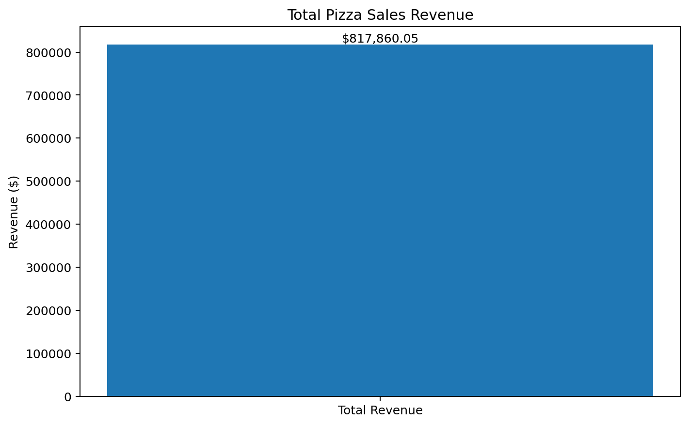
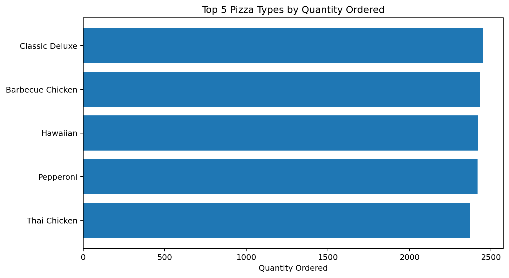
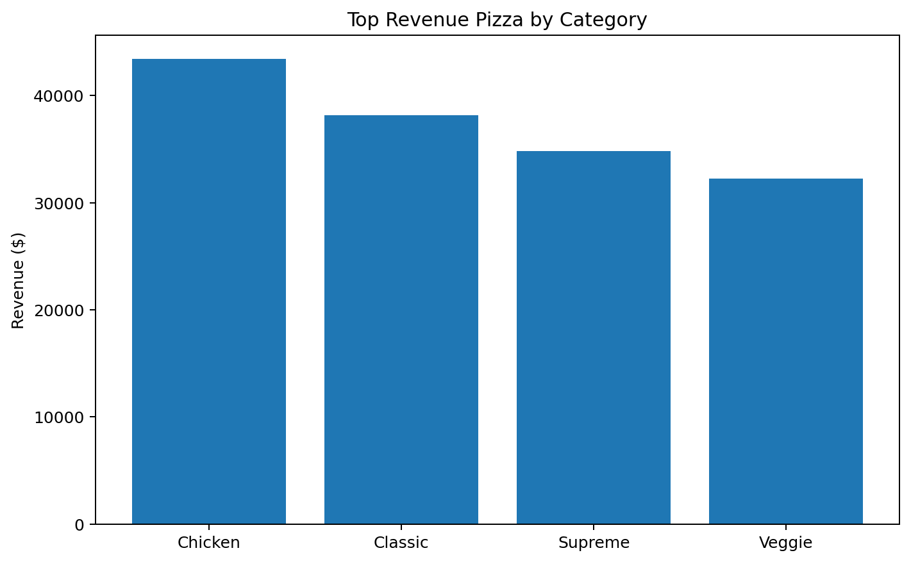

# 🍕 Pizza Sales SQL Analysis

## 📊 Project Overview

This project analyzes pizza sales data using **MySQL and SQL** to uncover business insights related to orders, sales volume, customer preferences, and revenue performance.

The project demonstrates how relational data can be transformed into meaningful business insights using SQL queries, aggregations, joins, subqueries, CTEs, and window functions.

---

## 🎯 Objectives

The analysis focuses on answering questions such as:

- How many orders were placed?
- How much revenue was generated?
- Which pizzas are ordered the most?
- Which pizza size is most popular?
- Which pizza categories generate the most sales?
- Which pizzas generate the highest revenue?
- How does revenue change over time?
- Which pizzas perform best within each category?

---

## 🛠️ Tools & Technologies

- **MySQL**
- **SQL**
- **Git**
- **GitHub**

### SQL Concepts Used

- SELECT
- WHERE
- GROUP BY
- ORDER BY
- JOIN
- Aggregate Functions
- CASE Statements
- Subqueries
- Common Table Expressions (CTEs)
- Window Functions
- `ROW_NUMBER()`
- Date & Time Functions
- Ranking
- Cumulative Analysis

---

# 🗄️ Database Schema

The dataset consists of four related tables:

### `orders`

Contains information about customer orders.

| Column | Description |
|---|---|
| order_id | Unique order identifier |
| date | Date of the order |
| time | Time of the order |

### `order_details`

Contains individual pizza items within each order.

| Column | Description |
|---|---|
| order_details_id | Unique order-detail identifier |
| order_id | Order identifier |
| pizza_id | Pizza identifier |
| quantity | Quantity ordered |

### `pizzas`

Contains pizza pricing and size information.

| Column | Description |
|---|---|
| pizza_id | Unique pizza identifier |
| pizza_type_id | Pizza type identifier |
| size | Pizza size |
| price | Pizza price |

### `pizza_types`

Contains pizza names, categories, and ingredients.

| Column | Description |
|---|---|
| pizza_type_id | Pizza type identifier |
| name | Pizza name |
| category | Pizza category |
| ingredients | Pizza ingredients |

---

## 🔗 Table Relationships

```text
pizza_types
     │
     │ pizza_type_id
     ▼
  pizzas
     │
     │ pizza_id
     ▼
order_details
     │
     │ order_id
     ▼
  orders
```

---

# ❓ Business Questions

The project answers **13 business questions**.

### Basic Analysis

1. What is the total number of orders?
2. What is the total revenue generated from pizza sales?
3. Which pizza has the highest price?
4. What is the most common pizza size ordered?
5. What are the top 5 most ordered pizza types?

### Intermediate Analysis

6. What is the total quantity of pizzas ordered by category?
7. How are orders distributed throughout the day?
8. How many pizzas are available in each category?
9. What is the average number of pizzas ordered per day?
10. What are the top 3 pizza types based on revenue?

### Advanced Analysis

11. What percentage of total revenue does each pizza type contribute?
12. What is the cumulative revenue generated over time?
13. What are the top 3 revenue-generating pizzas within each category?

---

# 📈 Key Findings

## 💰 Total Revenue

**$817,860.05**

## 🍕 Highest-Priced Pizza

**The Greek Pizza — XXL**

Price: **$35.95**

## 📏 Most Popular Pizza Size

**Large (L)**

Total quantity ordered: **18,956**

## 🏆 Top 5 Pizzas by Quantity Ordered

| Rank | Pizza | Quantity |
|---:|---|---:|
| 1 | The Classic Deluxe Pizza | 2,453 |
| 2 | The Barbecue Chicken Pizza | 2,432 |
| 3 | The Hawaiian Pizza | 2,422 |
| 4 | The Pepperoni Pizza | 2,418 |
| 5 | The Thai Chicken Pizza | 2,371 |

---

# 📊 Analysis Visualizations

### Total Revenue



### Top 5 Pizza Types by Quantity



### Top Revenue Pizza by Category



---

# 🥇 Top Revenue Pizza by Category

| Category | Pizza | Revenue |
|---|---|---:|
| Chicken | The Thai Chicken Pizza | $43,434.25 |
| Classic | The Classic Deluxe Pizza | $38,180.50 |
| Supreme | The Spicy Italian Pizza | $34,831.25 |
| Veggie | The Four Cheese Pizza | $32,265.70 |

---

# 📁 Project Structure

```text
pizza-sales-sql/
│
├── README.md
├── Questions.txt
├── pizza_sales_analysis.sql
│
└── data/
    ├── order_details.csv
    ├── orders.csv
    ├── pizza_types.csv
    └── pizzas.csv
```

---

# ▶️ How to Use

### 1. Clone the repository

```bash
git clone https://github.com/Jaskaransingh8009/pizza-sales-sql.git
cd pizza-sales-sql
```

### 2. Open MySQL

```bash
mysql -u root -p
```

### 3. Create the database

```sql
CREATE DATABASE pizza_sales;
USE pizza_sales;
```

### 4. Create and load the tables

Use the table definitions and CSV files provided in the repository.

### 5. Run the analysis

Open:

```text
pizza_sales_analysis.sql
```

and execute the queries in MySQL.

---

# 💡 Skills Demonstrated

- SQL data analysis
- Relational database concepts
- Multi-table JOINs
- Data aggregation
- CTEs
- Window functions
- Ranking
- Revenue analysis
- Date/time analysis
- Business-oriented problem solving
- Git & GitHub

---

# 🚀 Future Improvements

- Build an interactive **Power BI dashboard**
- Add monthly and daily sales visualizations
- Create KPI dashboards
- Perform deeper customer/order pattern analysis
- Automate the SQL analysis pipeline

---

# 👨‍💻 Author

**Jaskaran Singh**

B.Tech — Electronics and Communication Engineering  
Thapar Institute of Engineering and Technology

GitHub: [@Jaskaransingh8009](https://github.com/Jaskaransingh8009)

---

⭐ **If you find this project useful, feel free to explore the repository and star it!**
